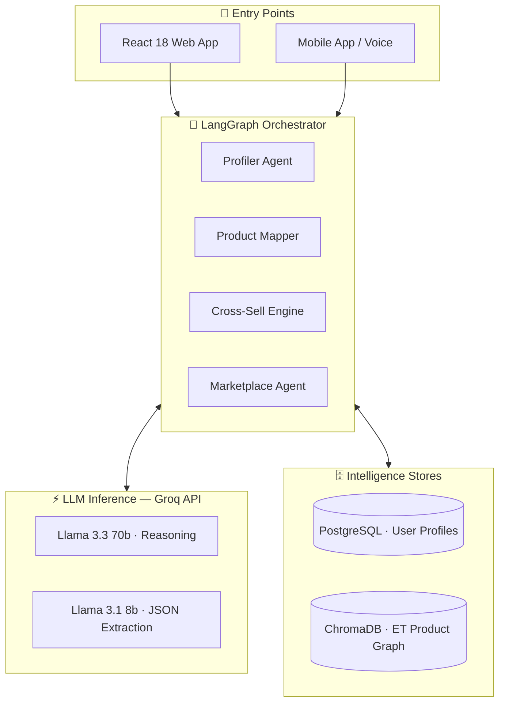
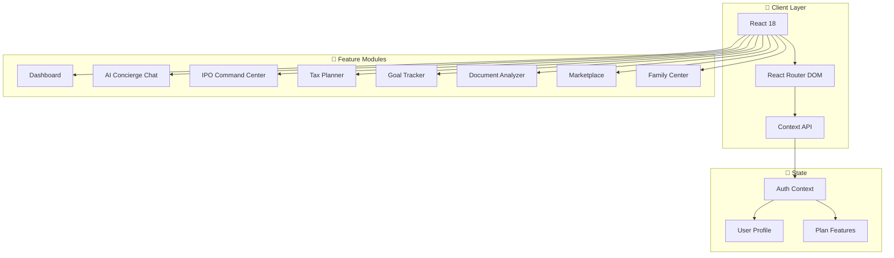

<div align="center">


<h3>🇮🇳 India's Most Intelligent Personal Finance Platform</h3>

<p>
  <strong>Built at Hackathon · Team AGI · Economic Times Ecosystem</strong>
</p>

---

[](https://react.dev)
[](https://vitejs.dev)
[](https://fastapi.tiangolo.com)
[](https://python.org)
[](https://langchain.com)
[](https://trychroma.com)
[](https://postgresql.org)
[](https://groq.com)

---

<table>
  <tr>
    <td align="center"><b>13+</b><br/><sub>Components</sub></td>
    <td align="center"><b>15,000+</b><br/><sub>Lines of Code</sub></td>
    <td align="center"><b>17</b><br/><sub>Routes</sub></td>
    <td align="center"><b>8</b><br/><sub>Core Modules</sub></td>
    <td align="center"><b>150M+</b><br/><sub>Target Users</sub></td>
    <td align="center"><b>₹5,000 Cr</b><br/><sub>Market TAM</sub></td>
  </tr>
</table>

</div>

---

## 🧭 Table of Contents

- [Overview](#-overview)
- [The Problem We Solve](#-the-problem-we-solve)
- [Core Features](#-core-features)
- [The 3-Minute Profiler](#%EF%B8%8F-the-3-minute-profiler)
- [Architecture](#-architecture)
- [Tech Stack](#-tech-stack)
- [Screenshots](#-screenshots)
- [Quick Start](#-quick-start)
- [Subscription Tiers](#-subscription-tiers)
- [Roadmap](#-roadmap)
- [Team AGI](#-team-agi)

---

## 🎯 Overview

**ET AI Concierge** is an intelligent orchestration platform acting as a **unified entry point** to the Economic Times ecosystem. Instead of forcing users to search, our AI conducts a natural **3-minute profiling conversation**, maps intent against an **ET Product Knowledge Graph**, and proactively routes users to the right content, tools, or marketplace partners.

> *"80% of Indian investors lack access to personalized financial advisory. We're fixing that."*

---

## ⚠️ The Problem We Solve

The Economic Times possesses a massive ecosystem — ET Prime, ET Markets, Masterclasses, corporate events, and financial partnerships. Yet **most users discover only 10% of what ET offers**.

| Pain Point | Impact |
|---|---|
| 🔴 Complex tax regulations (80C, HRA, Capital Gains) | Difficult to navigate without expert help |
| 🔴 IPO investment decisions require real-time analysis | Most platforms provide stale or fragmented data |
| 🔴 Goal-based planning is scattered across apps | No unified financial view |
| 🔴 Premium advisory tools locked behind expertise barriers | Retail investors are excluded |

---

## ✨ Core Features

### 🗣️ ET Welcome Concierge — *The 3-Minute Profiler*
State-machine driven profiling agent. Natural conversation. No forms. Just intelligence.

### 🧭 Financial Life Navigator
ChromaDB vector search maps your profile to the entire ET ecosystem — with personalized, narrative-driven recommendations.

### 🤖 AI Concierge Chat
Ask anything. Get personalized answers based on your profile, risk appetite, and life stage — via text or 🎤 voice.

### 📈 IPO Command Center
Live GMP tracking · Category-wise subscriptions · ASBA simulation · SEBI-compliant AI recommendations.

### 🔄 Cross-Sell Engine
Background behavioral signal processing for timely, non-intrusive upsells — powered by engagement analytics.

### 🏪 Services Marketplace Agent
Detects life events and connects you with partner services: HDFC, Bajaj, SBI for loans, credit, and insurance.

### 💰 Indian Tax Planner
Full 80C / 80D / HRA / LTCG / STCG calculators — built specifically for Indian tax law.

### 🎯 Goal Tracker
Multi-goal visual planning with animated SIP calculators, inflation-adjusted projections, and milestone celebrations 🎉

### 📰 ET Prime Content Hub
Tiered content — from free market updates to exclusive expert analysis and ET Now video integration.

### 👨‍👩‍👧‍👦 Family Wealth Center *(Elite)*
Consolidated family portfolio · Collaborative goal planning · Estate planning · Insurance gap analysis.

---

## 🗣️ The 3-Minute Profiler

```
┌─────────────────────────────────────────────────────────────────────┐
│                    THE 3-MINUTE DECISION FLOW                       │
├─────────────────────────────────────────────────────────────────────┤
│                                                                     │
│  TURN 0 ─ Greeting                                                  │
│  ┌────────────────────────────────────────────────────────────┐    │
│  │ 🤖 "What kind of work keeps you busy these days?"          │    │
│  │ → LLM extracts: Role · Industry · Seniority               │    │
│  └────────────────────────────────────────────────────────────┘    │
│                         │                                           │
│  TURN 1 ─ Track Split   ▼                                           │
│  ┌───────────────┬──────────────────┬─────────────────┐            │
│  │  CXO Track   │  Investor Track  │ Professional    │            │
│  │  Org queries │  Trading prefs   │ Skill building  │            │
│  └───────────────┴──────────────────┴─────────────────┘            │
│                         │                                           │
│  TURN 2 ─ Life Event Probe                                          │
│  ┌────────────────────────────────────────────────────────────┐    │
│  │ Detects: New job · Marriage · Inheritance · Home Purchase  │    │
│  │ → Switches: CONTENT-FIRST → MARKETPLACE-FIRST              │    │
│  └────────────────────────────────────────────────────────────┘    │
│                         │                                           │
│  RESOLUTION             ▼                                           │
│  ┌────────────────────────────────────────────────────────────┐    │
│  │ 🔍 ChromaDB Vector Search → ET Product Knowledge Graph     │    │
│  │ → Personalized Payoff Narrative → Right Tool, Right Time   │    │
│  └────────────────────────────────────────────────────────────┘    │
│                                                                     │
└─────────────────────────────────────────────────────────────────────┘
```

**Example session:**

```
🤖  "What kind of work keeps you busy these days?"
👤  "I'm a fund manager at Motilal Oswal"
    → role: FUND_MANAGER | track: INVESTOR | seniority: SENIOR

🤖  "Are you exploring any IPOs or sector rotations right now?"
👤  "Actually, I just got married and we're looking to buy a house"
    → ⚡ LIFE_EVENT: MARRIAGE + HOME_PURCHASE detected
    → switching: CONTENT_FIRST → MARKETPLACE_FIRST

    ChromaDB search...
    → top_match: ET_HDFC_HOME_LOAN     (score: 0.94)
    → top_match: ET_GOAL_TRACKER       (score: 0.89)
    → top_match: ET_TAX_PLANNER_80C    (score: 0.83)

✅  Routing to: Marketplace Agent + Goal Setup + Tax Planner
```

---

## 🏗️ Architecture

### System Overview

```
┌──────────────────────────────────────────────────────────────────┐
│                      ET AI CONCIERGE PLATFORM                    │
├──────────────────────────────────────────────────────────────────┤
│                                                                  │
│   📱 CLIENT LAYER              🧠 AI ORCHESTRATION               │
│   ┌──────────────────┐         ┌────────────────────────────┐   │
│   │  React 18 App    │ ──────► │  LangGraph State Machine   │   │
│   │  React Router    │         │  ┌─────────┐ ┌──────────┐ │   │
│   │  Context API     │         │  │Profiler │ │ Product  │ │   │
│   │  Web Speech API  │         │  │ Agent   │ │ Mapper   │ │   │
│   └──────────────────┘         │  └────┬────┘ └────┬─────┘ │   │
│                                │       │           │        │   │
│   🗄️ DATA LAYER                │  ┌────▼───────────▼──────┐ │   │
│   ┌──────────────────┐         │  │   Groq API            │ │   │
│   │  PostgreSQL       │ ◄─────► │  │  Llama 3.3 70b        │ │   │
│   │  ChromaDB         │         │  │  Llama 3.1 8b         │ │   │
│   │  localStorage     │         │  └───────────────────────┘ │   │
│   └──────────────────┘         └────────────────────────────┘   │
│                                                                  │
└──────────────────────────────────────────────────────────────────┘
```

### AI Backend



### Frontend Architecture



---

## 🛠️ Tech Stack

| Layer | Technology | Details |
|---|---|---|
| **UI Framework** | React 18 | Functional components, hooks, Context API |
| **Build Tool** | Vite 5 | HMR, optimized production builds |
| **Routing** | React Router DOM v6 | 15 protected + 2 public routes |
| **Styling** | CSS3 + Variables | Glassmorphism design system, dark mode |
| **Icons** | Lucide React | 500+ icons, consistent stroke |
| **Voice** | Web Speech API | Speech recognition & synthesis |
| **Documents** | FileReader API | PDF and image processing |
| **AI Orchestration** | LangGraph | Multi-agent state machine |
| **LLM** | Groq API | Llama 3.3 70b (reasoning) · Llama 3.1 8b (JSON) |
| **Backend** | FastAPI (Python 3.11) | ASGI, WebSocket support |
| **Vector Search** | ChromaDB | ET Product Knowledge Graph |
| **Database** | PostgreSQL (asyncpg) | Profiles, session memory |

---

## 📱 Screenshots

<div align="center">

| Dashboard | AI Concierge |
|---|---|
|  |  |
| *Financial command center* | *Conversational AI advisor* |

| IPO Center | Goal Tracker |
|---|---|
|  |  |
| *Live GMP & subscription data* | *Visual milestone tracking* |

</div>

---

## 🚀 Quick Start

### Prerequisites

```
Node.js >= 18
npm >= 9  (or yarn >= 1.22)
```

### Installation

```bash
# 1. Clone
git clone https://github.com/team-agi/et-ai-concierge.git
cd et-ai-concierge

# 2. Install
npm install

# 3. Start dev server
npm run dev
# → http://localhost:5173
```

### Production Build

```bash
npm run build      # Optimized output in dist/
npm run preview    # Preview the production build locally
```

---

## 💎 Subscription Tiers

<div align="center">

| Feature | 🥉 Basic (Free) | 🥈 Pro (₹4,999/yr) | 🥇 Elite (₹14,999/yr) |
|---|:---:|:---:|:---:|
| AI Queries / Day | 5 | 50 | ∞ Unlimited |
| Portfolio Projections | ❌ | ✅ | ✅ |
| Real-time Alerts | ❌ | ✅ | ✅ |
| ET Prime Access | ❌ | ✅ | ✅ |
| Advanced Tax Planning | ❌ | ✅ | ✅ |
| Family Portfolio | ❌ | ❌ | ✅ |
| Private Summits | ❌ | ❌ | ✅ |
| Masterclasses | ❌ | ❌ | ✅ |
| Dedicated Support | ❌ | ❌ | ✅ |
| Estate Planning | ❌ | ❌ | ✅ |

</div>

---

## 🛣️ Roadmap

```
Phase 1 — Foundation          ████████████████████  COMPLETE ✅
Phase 2 — AI Enhancement      ██████░░░░░░░░░░░░░░  Q2 2025  🔄
Phase 3 — Scale & Intelligence ░░░░░░░░░░░░░░░░░░░░  Q3 2025  📅
Phase 4 — Enterprise          ░░░░░░░░░░░░░░░░░░░░  Q4 2025  📅
```

### ✅ Phase 1 — Foundation (Complete)
- React 18 application architecture
- Glassmorphism design system
- 13 major feature components
- AI Concierge Chat Interface
- IPO Command Center (GMP, subscriptions)
- Goal Tracker with visualizations
- Tax Planner (80C, HRA, LTCG, STCG)
- Document Analyzer framework
- Marketplace & ET Prime integration
- Family Center (Elite tier)
- Subscription management
- Protected routes & authentication

### 🚀 Phase 2 — AI Enhancement (Q2 2025)
- Real-time NSE/BSE market data APIs
- Predictive portfolio analytics
- AI-powered stock screener
- Voice assistant in Hindi, Tamil, Telugu
- React Native mobile app
- Broker API integrations (Zerodha, Upstox, Groww)

### 📊 Phase 3 — Scale & Intelligence (Q3 2025)
- ML recommendation engine
- Risk analysis model
- Fraud detection layer
- AI tax filing assistant
- Crypto portfolio tracking
- International markets access

### 🏢 Phase 4 — Enterprise (Q4 2025)
- Family Office Suite
- AI estate planning
- Smart ML notifications
- Community Q&A forums
- Enterprise API for partners
- White-label solutions

---

## 🔐 Security & Compliance

- 🔒 **Data Encryption** — All sensitive data encrypted at rest
- 🛡️ **JWT Authentication** — Secure session management
- 🚫 **Privacy First** — User data never sold to third parties
- 📋 **SEBI Compliant** — All investment advisory follows SEBI guidelines
- 🌍 **GDPR Ready** — Full data portability and deletion rights

---

## 🌟 Why ET AI Concierge?

```
┌──────────────────────────────────────────────────────────────────┐
│  🇮🇳 INDIA-FIRST DESIGN                                          │
│  → Tax logic for Indian law (PPF, NPS, ELSS, 80C, HRA)          │
│  → UPI & ASBA integration                                        │
│  → Regional language support coming (Hindi, Tamil, Telugu)       │
├──────────────────────────────────────────────────────────────────┤
│  🤖 AI-POWERED INTELLIGENCE                                      │
│  → Natural language financial queries                            │
│  → Predictive portfolio analysis                                 │
│  → Document intelligence (upload & analyze)                      │
├──────────────────────────────────────────────────────────────────┤
│  📰 ET BRAND TRUST                                               │
│  → 33+ years of Economic Times expertise                         │
│  → Verified market data and journalism                           │
│  → SEBI-registered advisory framework                            │
├──────────────────────────────────────────────────────────────────┤
│  🎯 HOLISTIC FINANCIAL VIEW                                      │
│  → Goals, taxes, insurance, estate — all in one place            │
│  → Family-wide financial planning                                │
│  → Life-stage based recommendations                              │
└──────────────────────────────────────────────────────────────────┘
```

---

## 📂 Route Structure

```
/public
├── /login                → Login.jsx
└── /signup               → Signup.jsx

/protected
├── /                     → Dashboard.jsx
├── /concierge            → AI Concierge Chat
├── /simulator            → Portfolio Simulator
├── /ipo                  → IPO Command Center
├── /tax-planner          → Tax Planner
├── /goals                → Goal Tracker
├── /documents            → Document Analyzer
├── /marketplace          → Services Marketplace
├── /et-prime             → ET Prime Content Hub
├── /family               → Family Center (Elite)
└── /business-model       → Revenue Info
```

---

## 👥 Team AGI

<div align="center">

| Role | Contribution |
|---|---|
| ⚛️ **Frontend Engineers** | React architecture, state management, 13 production components |
| 🎨 **UI/UX Designers** | Glassmorphism system, responsive design, user experience flows |
| 🤖 **AI Specialists** | LangGraph orchestration, Groq inference, ChromaDB vector search |
| 📊 **Finance Experts** | Tax logic, investment algorithms, SEBI compliance |

</div>

---

## 📞 Contact & Support

| Channel | Details |
|---|---|
| 🌐 Website | [etconcierge.economictimes.com](https://etconcierge.economictimes.com) |
| 📧 Email | support@etconcierge.com |
| 💬 Live Chat | Available in-app |
| 📱 Helpline | 1800-ET-HELP (1800-38-4357) |

---

<div align="center">

---

### 🚀 Built with ❤️ by Team AGI

*Revolutionizing Personal Finance for India* 🇮🇳

**[⭐ Star this repo](https://github.com/team-agi/et-ai-concierge)** · **[🐛 Report Bug](https://github.com/team-agi/et-ai-concierge/issues)** · **[💡 Request Feature](https://github.com/team-agi/et-ai-concierge/issues)**

---

*© 2024 The Economic Times — Times Internet Limited. All rights reserved.*

</div>
